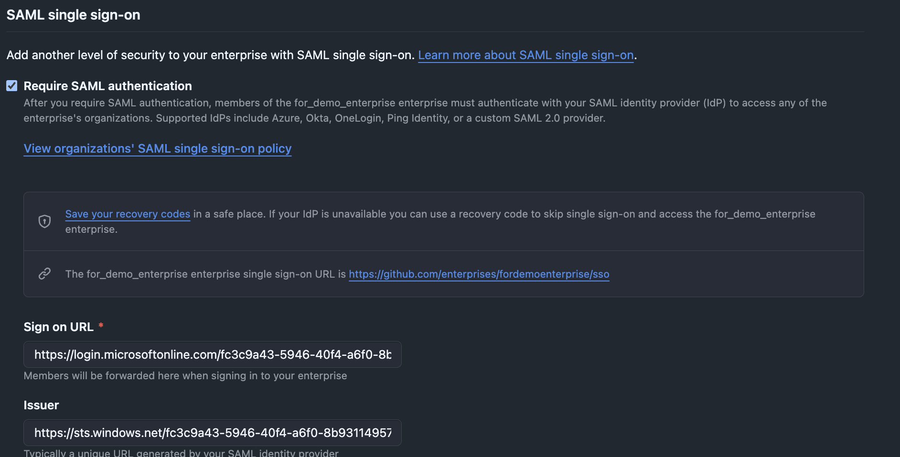
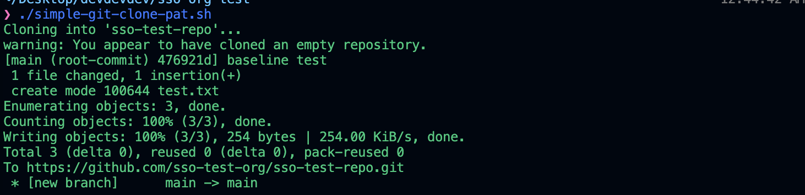
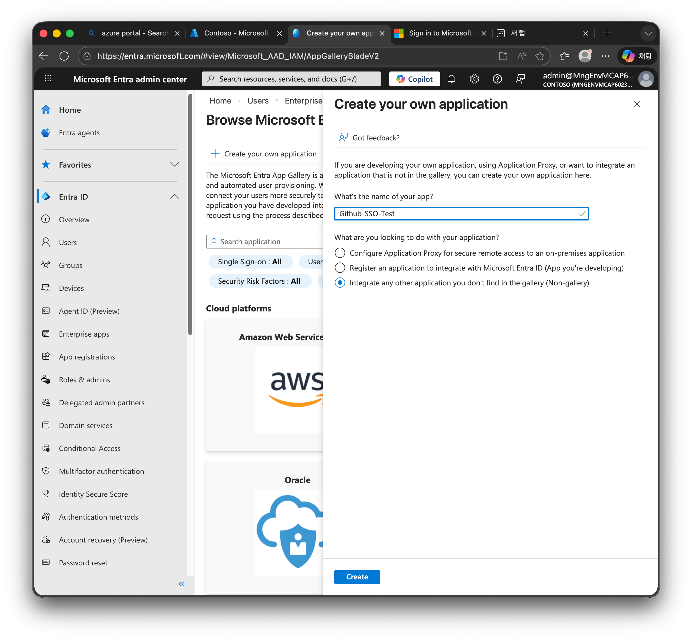
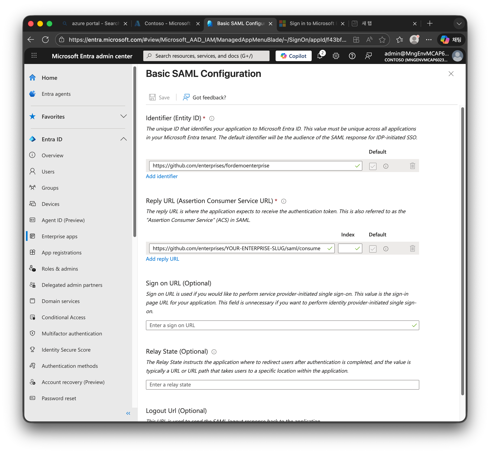
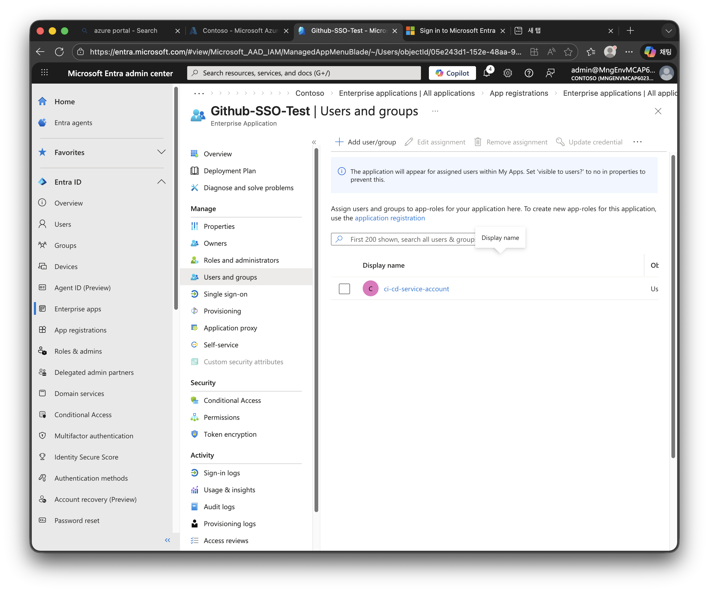
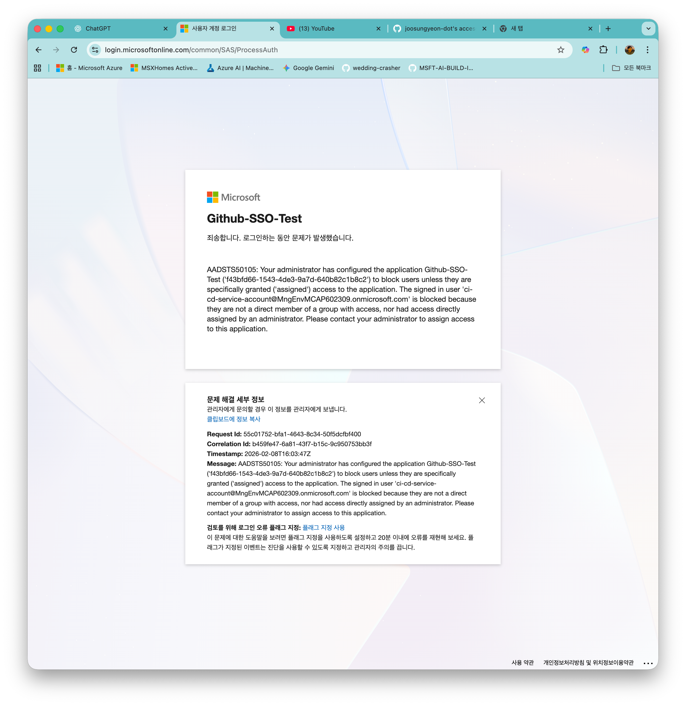
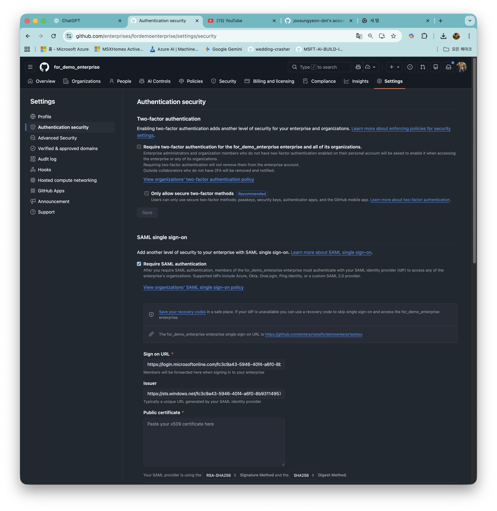
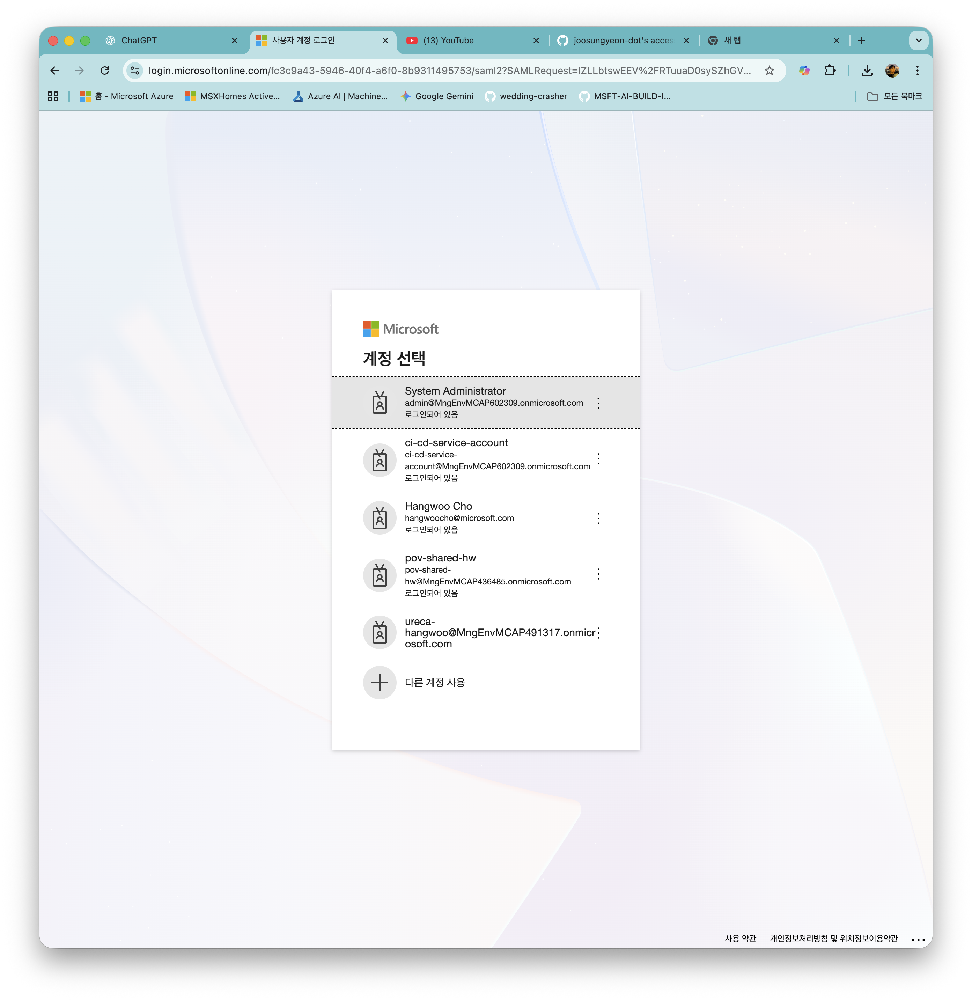
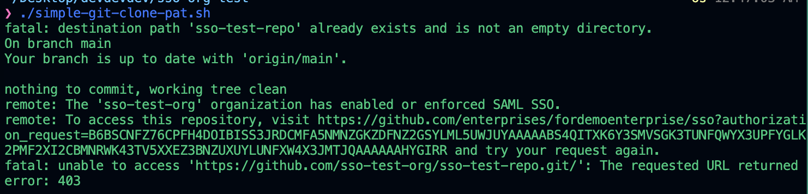
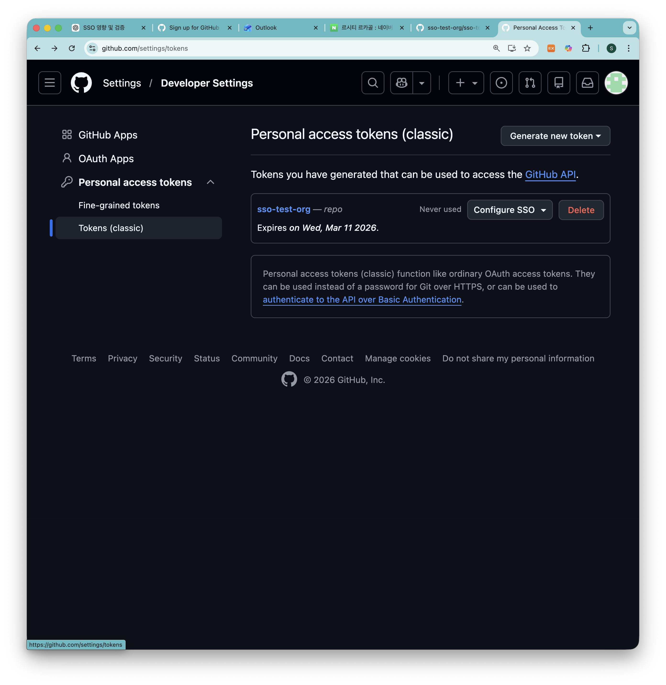

# How to Set Up Azure App-Based SSO for GitHub Enterprise — and What Happens to CI/CD After Enforcement



## 1. 목적

본 문서는 아래 두 가지를 **실제 동작 기반으로 검증**하기 위해 작성되었습니다.

> 1. **Azure Entra ID의 Enterprise Application을 통해 GitHub Enterprise에 SAML SSO를 어떻게 설정하는가?**
> 2. **SSO Enforce 이후 서비스 계정(PAT 기반) CI/CD 배포에 어떤 영향이 발생하며, 어떻게 복구하는가?**

### 다루는 범위

- Azure Entra ID에서 Enterprise Application(SAML) 생성 및 설정 절차
- GitHub Enterprise에 SAML SSO 연결 및 Enforce 방법
- SSO 적용 전후 PAT 기반 git push 동작 비교
- SSO Enforce 후 PAT Authorize를 통한 복구 절차

### 고객 우려사항

- SSO 적용 시 운영 영향 발생 가능성
- 서비스 계정(ID/PW, PAT) 기반 배포 중단 위험

---

## 2. 아키텍처

```
┌─────────────────────────────────────┐
│         Azure Tenant (Entra ID)     │
│                                     │
│   ┌────────────┐  ┌─────────────┐   │
│   │  dev-user   │  │   ci-bot    │   │
│   │ (관리자 계정)│  │(서비스 계정) │   │
│   └──────┬─────┘  └──────┬──────┘   │
│          │               │          │
└──────────┼───────────────┼──────────┘
           │  SAML SSO     │
           ▼               ▼
┌─────────────────────────────────────┐
│       GitHub Enterprise             │
│                                     │
│   Organization: sso-test-org        │
│   ┌────────────────────────────┐    │
│   │  Repository: sso-test-repo │    │
│   │  (Private)                 │    │
│   └────────────────────────────┘    │
│                                     │
│   Members:                          │
│     dev-user → Owner                │
│     ci-bot   → Write                │
│                                     │
│   CI/CD 인증 방식:                    │
│     ci-bot + PAT → HTTPS git push   │
│                                     │
└─────────────────────────────────────┘
```

---

## 3. 핵심 검증 시나리오

```
SSO 미적용 상태
  → ci-bot + PAT로 git push 성공 (Baseline)

SSO Enforce 이후
  → 동일 PAT로 git push 시도
  → 403 실패 확인

SSO Authorize 수행 후
  → 동일 PAT로 git push 재시도
  → 복구 확인
```

---

## 4. 사용 계정 구조

### Entra ID

| 계정 | 용도 |
|------|------|
| `dev-user@tenant` | 관리자, Enterprise Owner |
| `ci-bot@tenant` | 서비스 계정, CI/CD 테스트용 |

### GitHub

| 계정 | 용도 |
|------|------|
| `dev-user` | Enterprise 생성 및 SSO 설정 |
| `ci-bot` | PAT 기반 배포 테스트 |

> 두 계정 모두 동일 Entra 테넌트 사용자 기반

---

## 5. 전체 단계 개요

| 단계 | 상태 | 목적 |
|------|------|------|
| 1 | Entra 사용자 생성 | 관리자/서비스 계정 준비 |
| 2 | GitHub 계정 생성 | 동일 테넌트 사용자 |
| 3 | Enterprise + Org + Repo 생성 | 테스트 환경 구축 |
| 4 | SSO 없이 CI/CD 테스트 | Baseline 확보 |
| 5 | Entra SSO 연결 (비강제) | 인증 연동 확인 |
| 6 | SSO Enforce 후 재테스트 | 운영 영향 검증 |

---

## 6. 상세 절차 및 결과

---

### Step 1. Entra ID 사용자 생성

Entra Admin Center에서 사용자 생성:

```
Users → New user
```

생성 계정:

```
dev-user@tenant.onmicrosoft.com
ci-bot@tenant.onmicrosoft.com
```

---

### Step 2. GitHub 계정 생성

각각 GitHub 계정 생성:

| Entra 계정 | GitHub username |
|------------|-----------------|
| `dev-user@tenant` | `dev-user-admin` |
| `ci-bot@tenant` | `ci-bot` |

---

### Step 3. GitHub Enterprise 환경 구성

#### 3-1. Enterprise 생성

`dev-user`로 로그인 후 Enterprise account 생성 → `sso-test-enterprise`

#### 3-2. Organization 생성

Enterprise 내부에 `sso-test-org` 생성

#### 3-3. Repository 생성

Org 내부에 `sso-test-repo` (Private) 생성

#### 3-4. 서비스 계정 초대

```
Organization → Settings → People → Invite member → ci-bot (Write 권한)
```

---

### Step 4. Baseline: SSO 없이 CI/CD 동작 확인

#### 4-1. ci-bot에서 PAT 생성

```
Settings → Developer settings → Personal access tokens → Tokens (classic) → Generate
```

권한: `repo`

#### 4-2. git push 테스트

[super-simple-cicd-code.sh](super-simple-cicd-code.sh) 스크립트 실행:

```bash
./super-simple-cicd-code.sh
```

#### ✅ 결과: push 성공 — Baseline 확보



---

### Step 5. Entra 기반 SSO 연결 (비강제 상태)

#### 5-1. Entra에서 SAML 앱 생성

```
Entra ID → Enterprise applications → New application → Create your own application
```

이름: `Github-SSO-Test`



#### 5-2. SAML 설정

```
Single sign-on → SAML
```



확인할 값:

| 항목 | 사용 위치 |
|------|----------|
| Login URL | GitHub Sign-on URL |
| Microsoft Entra Identifier | GitHub Issuer |
| Certificate (Base64) | GitHub Public certificate |
| Logout URL | GitHub Logout URL |

#### 5-3. 사용자 할당

```
Enterprise applications → Github-SSO-Test → Users and groups → Add user
```

추가: `dev-user`, `ci-bot`



> ⚠️ 사용자를 Entra App에 할당하지 않으면 SSO 인증 시 아래와 같은 오류가 발생합니다:



#### 5-4. GitHub Enterprise에 SSO 연결

```
Enterprise → Settings → Authentication security → SAML SSO → Configure
```

| GitHub 필드 | Entra 값 |
|-------------|----------|
| Sign on URL | Login URL |
| Issuer | Microsoft Entra Identifier |
| Public certificate | Certificate (Base64) |
| Logout URL | Logout URL |



#### 5-5. SSO 로그인 테스트

```
Test SAML configuration → 정상 확인
```



결과: `SSO Enabled (Not enforced)`

---

### Step 6. 핵심 검증 — SSO Enforce 후 CI/CD 영향 확인

#### 6-1. SSO Enforce

```
GitHub Enterprise → Settings → Authentication security → SAML SSO → Enforce SSO
```

#### 6-2. 기존 PAT로 push 재시도

```bash
git push
```

#### ❌ 결과: 403 오류 — SSO가 PAT 차단

```
403
Resource protected by organization SAML enforcement.
You must authorize this token for SSO.
```



> 이 로그가 핵심 근거입니다. SSO Enforce 시 기존 PAT는 즉시 차단됩니다.

#### 6-3. 서비스 계정 SSO Authorize

ci-bot 로그인 후:

```
Settings → Developer settings → Personal access tokens → Tokens (classic)
→ 해당 토큰의 "Configure SSO" → Authorize
```



#### 6-4. 동일 PAT로 push 재시도

```bash
git push
```

#### ✅ 결과: push 성공 — 운영 복구 확인


---

## 7. 결과 해석 기준

| 상태 | 의미 |
|------|------|
| Enforce 후 push 실패 | SSO가 PAT 차단 |
| Authorize 후 push 성공 | 운영 영향은 절차적 이슈 |
| Authorize 후에도 실패 | 구조적 문제 (GitHub App 필요) |

---

## 8. 최종 기술 결론

> SSO Enforce 이후 기존 PAT 기반 서비스 계정 배포는 초기 상태에서 **403 오류로 차단**될 수 있습니다.
> 다만 해당 토큰에 대해 **SSO 승인(Authorize)을 수행하면 기존과 동일하게 배포가 가능**합니다.
>
> 따라서 운영 영향은 **토큰 승인 절차를 포함한 런북 정비 이슈**로 판단되며,
> 장기적으로는 **GitHub App 기반 인증으로 전환**하는 것이 보다 안정적인 구조입니다.

---

## 9. 핵심 체크포인트 요약

- [x] Baseline: ci-bot + PAT push 성공
- [x] SSO 연결 (비강제)
- [x] SSO Enforce
- [x] 동일 PAT로 push → 403 확인
- [x] SSO Authorize
- [x] push 재성공 확인

---

## 10. 프로젝트 구조

```
sso-org-test/
├── README.md                         ← 본 문서
├── super-simple-cicd-code.sh         ← Baseline CI/CD 테스트 스크립트
├── experiment-images/                ← 검증 스크린샷
│   ├── commit-success-without-sso-saml.png
│   ├── commit-fail-with-sso-saml.png
│   ├── create-azure-app.png
│   ├── config-azure-app-saml.png
│   ├── error-when-not-link-entra-id-to-app.png
│   ├── put-sso-saml-info-in-github-enterprise.png
│   ├── sso-screen-with-azure-app.png
│   ├── add-cicd-entra-id-to-azure-app.png
│   ├── configure-sso-with-pat-token.png
│   └── success-after-configure-pat-with-sso.png
└── sso-test-repo/                    ← 클론된 테스트 레포
```
